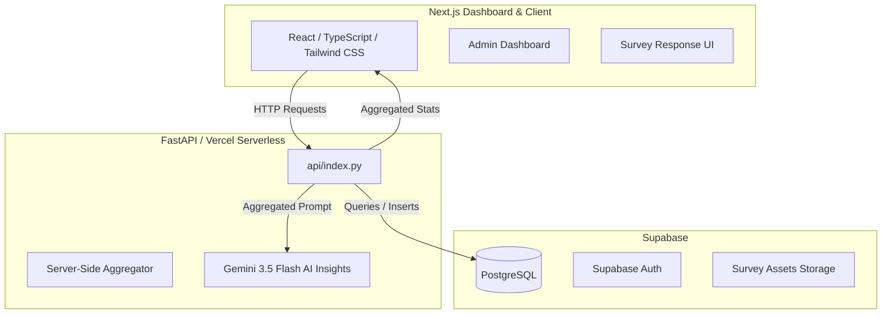

# CYC Survey Platform

Welcome to the CYC Survey Platform! This project is a highly interactive, responsive, and scales to handle high volumes of survey responses. This guide is designed to help you understand the architecture, design patterns, and development workflow.

---

## 🏗️ Architecture Overview

The application uses a hybrid architecture designed for seamless deployment on Vercel:



### 1. Frontend (Next.js + TypeScript)
- **App Router**: Uses Next.js App Router (`src/app/`) for directory-based routing.
- **Styling**: Built with **Tailwind CSS** and **Lucide React** icons.
- **Dynamic Render**: Fast interactive charts, administrative tables, and responsive forms.

### 2. Backend (FastAPI + Python)
- **Vercel Serverless Integration**: Vercel routes `/api/*` requests directly to `api/index.py` using Python serverless functions (configured in [vercel.json](file:///Users/zishine/VSCODE/CYC/survey_plat/vercel.json)).
- **FastAPI Framework**: Handled efficiently with Pydantic schemas for request/response serialization.

### 3. Database (Supabase PostgreSQL)
- Stores surveys, questions, respondent sessions, and answers.
- Media assets and survey attachments are stored using Supabase Storage.

---

## ⚡ Scalability & High-Performance Design

This project is optimized to comfortably handle **10,000+ total responses** across surveys (and **3,000+ per survey**) while strictly remaining within Vercel's Serverless Function payload limit (4.5MB) and keeping the React frontend fluid:

### 📊 Server-Side Aggregation Pattern
* **The Problem**: Transferring thousands of raw database response objects to the client freezes the React virtual DOM and hits Vercel payload limit walls.
* **The Solution**: 
  - The Python FastAPI backend does the heavy lifting. It queries the database, processes raw records, and calculates complex statistical metrics (mean, median, variance, standard deviation, quartiles, and outliers) in-memory using optimized native helper algorithms.
  - The Next.js frontend only receives a highly compact, lightweight JSON payload containing these pre-computed `summary_stats` to render directly onto the charts.
  
### 🤖 Optimized AI Insights
* **Model Configuration**: The AI engine strictly uses **`gemini-3.5-flash`** for quick, cost-efficient, and accurate analytical insight generation.
* **Token Efficiency**: Instead of sending massive logs of raw responses, the backend builds clean prompt contexts utilizing the **aggregated statistics**. This reduces the AI token consumption by **over 95%** and bypasses context length limits.
* **Scope**: The surveys focus exclusively on multiple-choice and numeric rating questions (open-ended text questions are not supported).

---

## 🛠️ Getting Started

### 1. Environment Variables
Create a `.env.local` file in the root directory (based on your credentials):

```env
SUPABASE_URL=your_supabase_url
SUPABASE_KEY=your_supabase_anon_or_service_role_key
GEMINI_API_KEY=your_gemini_api_key
```

### 2. Install Dependencies
```bash
# Install Node/Frontend dependencies
npm install

# (Optional) Create Python virtual environment for local FastAPI testing
python3 -m venv venv
source venv/bin/activate
pip install -r requirements.txt
```

### 3. Run Locally
Start the Next.js development server:
```bash
npm run dev
```
The server will start at `http://localhost:3000`. Vercel CLI can also be used (`vercel dev`) to test the frontend and python backend routes concurrently in local environments.

---

## 📁 Directory Structure

* [src/app](file:///Users/zishine/VSCODE/CYC/survey_plat/src/app) - Next.js Page views and dashboard routing.
* [src/components](file:///Users/zishine/VSCODE/CYC/survey_plat/src/components) - Reusable React interface components.
* [api](file:///Users/zishine/VSCODE/CYC/survey_plat/api) - FastAPI source file (`index.py`) containing the Python serverless endpoints.
* [db_scripts](file:///Users/zishine/VSCODE/CYC/survey_plat/db_scripts) - SQL migrations and database setup scripts.